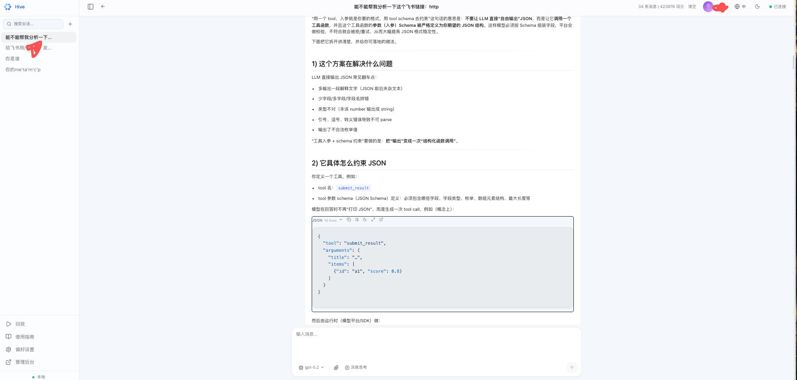

# agents-hive

agents-hive 是面向 ReAct Agent 的工程化 Harness 与质量控制系统。它以 Runtime 为执行内核，以 Quality Control Plane 为治理外层，把工具 / Skill / MCP 准入、SubAgent / ACP 协作、Memory / Context、IM Channel、权限审计、Replay / Journal、评测门禁和优化回滚纳入同一条可验证执行链路，让 Agent 从“能调用工具的聊天助手”升级为可托管、可约束、可复盘、可评分、可回归、可持续进化的复杂任务执行单元。

[](https://golang.org)
[](LICENSE)

## 项目定位

agents-hive 的核心目标是把 Agent 从“能运行”推进到“可运营、可验证、可持续改进”：

- 给用户可直接使用的 Web / CLI / IM 入口，但所有入口都进入同一条可追踪的会话和执行链路。
- 给 Agent 受控的 ReAct 执行循环，覆盖工具选择、计划状态、定时任务、上下文 / 记忆、SubAgent / ACP 协作和 HITL。
- 给团队质量闭环：Replay / Journal、质量事件、失败分类、回归样本和评测门禁。
- 给企业运行治理：权限、沙箱、成本 / 配额、审计、多租户、运行策略，以及人工审批的优化与回滚。

它不是纯 SDK、聊天壳或工具集合。更准确地说，它是 Agent Runtime + Agent Harness + Quality Control Plane + Ops Workbench。

## 核心能力

**Agent Runtime**

- Master Agent 基于 ReAct 循环执行任务，支持工具调用、用户确认、上下文压缩和长任务恢复。
- Plan Runtime 将长任务拆成 session-scoped todos，并在 UI 中实时展示进度。
- 意图契约在外部发送等副作用任务上做结构化完成度检查，最终回复写入和广播前会判断是否真正完成、需要追问、需要重试或应当失败。
- 定时任务 Runtime 支持按 cron 或 interval 自动执行 session 任务和 IM 推送任务，带 owner 隔离、运行历史、手动触发、启动恢复和后台 claim/run。
- SubAgent 支持探索、总结、标题生成、压缩等独立角色，也支持远程 Agent / ACP 集成。
- 工具发现、能力准入、并行分发和 Skill 调用分层治理，降低工具暴露成本并提升任务分发质量。

**工具与扩展**

- 内置文件、搜索、Shell、Patch、Web、LSP、图片/语音/视频、IM 发送、任务板、记忆等工具。
- MCP Host 统一承载内置工具、自定义工具和外部 MCP Server。
- Skills 系统用 Markdown 描述能力包，支持本地、DB 覆盖、按需安装和权限治理。
- 工具准入、脚本执行、危险操作审批和运行时策略统一纳入治理链路。
- 插件运行时支持将扩展能力以独立进程接入。

**会话与可观测性**

- PostgreSQL 持久化会话、消息、配置、Prompt、Skill、质量用例和运行数据。
- Session fork / revert / regenerate / trace / trajectory 支持调试和回放。
- Replay Gallery、Session Replay、Quality Workbench 用于复盘 Agent 行为和生成评估样本。
- 用量统计、token accounting、质量候选池、自动优化建议、工具路由指标、意图完成指标和定时任务运行记录为后续治理提供数据面。

**管理台**

- LLM Provider / Model 管理。
- Prompt 热更新和 smoke eval。
- Skill 管理和按需加载治理。
- Scheduled Tasks 支持任务 CRUD、cron/interval 调度、启停、立即运行、运行历史和管理员全局列表。
- 用户、认证、配额和用量统计。
- Memory Governance、Quality Workbench、自动优化、运行时策略查看。

**Channel 集成**

- 支持飞书、钉钉、企业微信、微信等 IM Channel。
- 飞书方向包含入站解析、交互回调、身份解析、出站发送、推送、观测、可靠性、安全和多租户治理文档。
- 微信机器人通道支持官方 wechatbot/iLink 接入，并复用统一 Channel 渲染、审计和会话链路。
- Channel 侧和 Web UI 共享会话、权限、HITL 和审计链路。

## 界面概览

> 截图建议放在 `assets/screenshots/`，保持 16:10 或 16:9 桌面视口。README 只放核心界面，不放本地规划或过程截图。

**Chat Runtime**



主聊天工作台，展示流式回复、工具调用、HITL、附件、Todos 和执行状态。建议截图中包含一次真实工具调用或任务进度，而不是空白聊天页。

**Replay / Journal**


执行回放视图，展示消息、工具调用、质量事件、trace 和关键决策时间线。建议截图中选中一个失败或重试节点，体现“过程可查、失败可归因”。

**Quality Workbench**


质量治理工作台，展示失败聚类、回归样本、批量 replay、评测结果和优化建议。建议截图保留左侧导航和主表格，让读者看到这是控制面而不是单页报表。

**Scheduled Tasks**


定时任务管理页，展示 cron / interval 调度、启停、立即运行和运行历史。建议截图包含任务列表与运行记录抽屉或详情区。

## 快速开始

### Docker Compose

Docker 部署包含 Hive 主服务和 PostgreSQL。Hive 主服务内嵌前端静态资源，并通过宿主机 Docker socket 创建 sandbox 容器执行隔离任务。

```bash
git clone https://github.com/chef-guo/agents-hive.git
cd agents-hive

# 生产环境请使用强密码
cat > .env <<EOF
POSTGRES_PASSWORD=your_strong_password
DOCKER_GID=$(stat -c '%g' /var/run/docker.sock)
TZ=Asia/Shanghai
HIVE_PORT=8080
EOF

mkdir -p /opt/hive/workdir/sessions

docker compose up -d
docker compose logs -f hive
```

访问：

```text
http://localhost:8080
```

如果需要单独构建镜像：

```bash
docker build -t hive:latest .
docker build -t hive-sandbox:latest -f docker/sandbox/Dockerfile .
```

部署细节以 [docker-compose.yml](docker-compose.yml) 和 [docker/config.docker.json](docker/config.docker.json) 为准。sandbox bind mount 路径必须在宿主机和 Hive 容器内一致，默认使用 `/opt/hive/workdir`。

### 本地开发

本地开发需要 Go、Node.js、PostgreSQL。

```bash
git clone https://github.com/chef-guo/agents-hive.git
cd agents-hive

cp config.example.json config.json
# 编辑 config.json 或设置 POSTGRES_* / DATABASE_URL 等环境变量

go build -o claw ./cmd/claw
go build -o server ./cmd/server
```

启动后端：

```bash
./server
```

启动前端开发服务器：

```bash
cd frontend
npm install
npm run dev
```

CLI 模式：

```bash
./claw "分析当前项目结构"
./claw -i
```

## 架构概览

```text
                 Web UI / CLI / HTTP API / IM Channel
                              |
                              v
                    API Server / Gateway / Auth
                              |
                              v
               Master Agent <--- Scheduler / Scheduled Tasks
                              |
          +-------------------+-------------------+
          |                   |                   |
          v                   v                   v
      Tool Runtime        Plan Runtime        SubAgents / ACP
      MCP Host            Todos / Resume      Remote Agents
          |
          v
  Files / Shell / LSP / Web / IM / Memory / Custom MCP

          PostgreSQL stores sessions, config, prompts, skills,
          memory, scheduled tasks, quality data, trace data and accounting data.
```

关键代码路径：

| 路径 | 说明 |
|------|------|
| `cmd/claw` | CLI 入口 |
| `cmd/server` | HTTP Server 入口 |
| `frontend/src` | React 管理台和 Chat UI |
| `internal/master` | Master Agent、ReAct、计划执行、反思和会话循环 |
| `internal/tools` | 内置工具、工具搜索、任务工具、IM 工具 |
| `internal/mcphost` | MCP 工具宿主和 schema 转换 |
| `internal/subagent` | SubAgent 框架 |
| `internal/acpserver` / `internal/acpclient` | ACP 服务端和客户端 |
| `internal/channel` | 飞书、钉钉、企业微信、微信等 Channel |
| `internal/api` | HTTP API、管理台 API、会话 API |
| `internal/store` | PostgreSQL 存储和迁移 |
| `internal/bootstrap` | 服务启动、定时任务恢复和后台运行循环 |
| `internal/agentquality` | Agent 质量样本、评估、建议和回滚 |
| `internal/qualityworkbench` | 质量工作台、回放、分组、报告 |
| `internal/trajectory` | 会话轨迹快照 |
| `internal/webui/dist` | 前端构建产物，由 Vite 生成并被 Go embed |

## 配置模型

agents-hive 使用两层配置：

- **启动配置**：服务监听、日志、数据库连接等启动前必须知道的参数，来自 `config.json`、环境变量或 CLI flags。
- **运行时配置**：LLM、Prompt、Skill、Channel、权限、Memory、MCP 等可在 Web UI 或 API 中修改，存储在 PostgreSQL。

常用环境变量：

| 环境变量 | 说明 |
|----------|------|
| `DATABASE_URL` | PostgreSQL DSN，优先于拆分字段 |
| `POSTGRES_HOST` / `POSTGRES_PORT` / `POSTGRES_DB` | PostgreSQL 地址、端口、库名 |
| `POSTGRES_USER` / `POSTGRES_PASSWORD` / `POSTGRES_SSL_MODE` | PostgreSQL 认证和 SSL 配置 |
| `SESSIONS_DIR` | 会话工作目录 |
| `CUSTOM_TOOLS_DIR` | 自定义工具目录 |
| `CLAW_API_KEY` / `OPENAI_API_KEY` | 首次启动初始化 LLM 配置 |
| `CLAW_LOG_FILE` / `CLAW_LOG_LEVEL` / `CLAW_CONSOLE_LEVEL` | 日志配置 |

完整示例见 [config.example.json](config.example.json)。

## Web UI

前端位于 [frontend](frontend)，使用 React、Vite、TypeScript、Tailwind CSS。

常用命令：

```bash
cd frontend
npm install
npm run dev
npm run build
npm run lint
npm test
```

`npm run build` 会把产物写入 `internal/webui/dist/`，Go 服务通过 `internal/webui/embed.go` 嵌入该目录。不要手工编辑 `internal/webui/dist/`。

主要页面：

- Chat：会话、工具调用、HITL、附件、Canvas、Todos。
- Sessions：会话列表、星标、标签、fork、revert。
- Replay Gallery / Session Replay：会话回放和轨迹查看。
- Settings：运行时配置、MCP、权限、IM Channel、远程 Agent。
- Admin：LLM、Prompt、Skill、用户、用量、Memory、质量工作台、自动优化、定时任务。

UI 设计约束见 [DESIGN.md](DESIGN.md)。

## API 入口

HTTP API 默认前缀：

```text
http://localhost:8080/api/v1
```

常用资源：

| 方法 | 路径 | 说明 |
|------|------|------|
| `GET` | `/health` | 健康检查 |
| `GET` | `/capabilities` | 能力列表 |
| `POST` | `/sessions` | 创建会话 |
| `GET` | `/sessions` | 会话列表 |
| `POST` | `/sessions/{id}/messages` | 发送消息 |
| `GET` | `/sessions/{id}/messages` | 读取消息 |
| `GET` | `/sessions/{id}/todos` | 读取会话 todos |
| `GET` | `/sessions/{id}/trace` | 读取会话 trace |
| `GET` | `/sessions/{id}/trajectory/{step}` | 读取轨迹快照 |
| `POST` | `/sessions/{id}/fork` | Fork 会话 |
| `POST` | `/sessions/{id}/revert` | Revert 会话 |
| `GET/POST/PUT/DELETE` | `/scheduled-tasks[/{id}]` | 定时任务 CRUD |
| `POST` | `/scheduled-tasks/{id}/toggle` | 启停定时任务 |
| `POST` | `/scheduled-tasks/{id}/run-now` | 手动触发定时任务 |
| `GET` | `/scheduled-tasks/{id}/runs` | 定时任务运行历史 |
| `GET` | `/admin/scheduled-tasks` | 管理员读取全局定时任务 |
| `POST/GET/DELETE` | `/channels/push/schedules[/{id}]` | 兼容旧版 IM push 定时任务接口 |
| `GET` | `/ws` | WebSocket 实时事件 |

更多路由见 [internal/api/routes.go](internal/api/routes.go)。

## 开发规范

- Go 代码使用 `gofmt`。
- Go 注释和日志使用中文，错误保持结构化。
- 测试优先使用表驱动风格。
- 前端使用 TypeScript、React、ESLint，保持现有组件和样式约定。
- 不手工编辑 `internal/webui/dist/`，只通过 `frontend/npm run build` 生成。
- 真实密钥只放在本地配置或环境变量，不提交 `config.json`、`.env` 等敏感文件。

常用验证：

```bash
go test ./... -v
go test -race ./...
go test -cover ./...

cd frontend
npm run lint
npm run build
npm test
```

## 许可证

MIT License

## 联系方式

- Issues: https://github.com/chef-guo/agents-hive/issues
