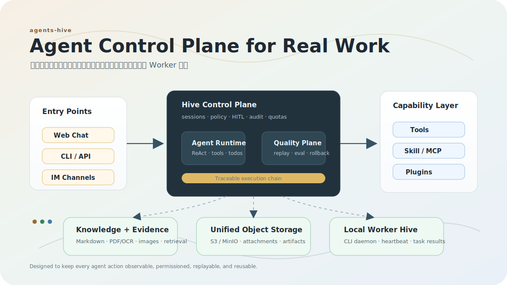
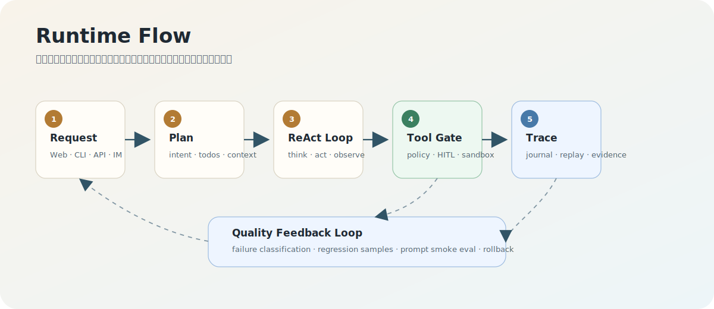
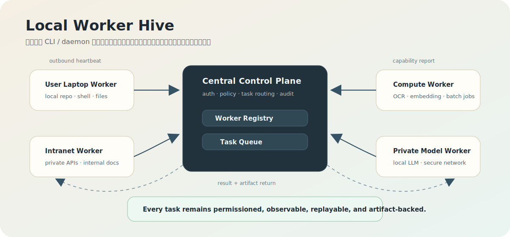
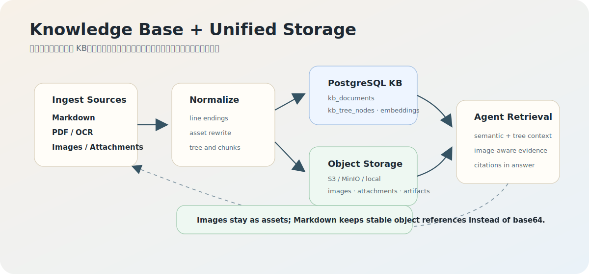

# agents-hive

**语言 / Language:** 中文 | [English](README.en.md)

[](https://golang.org)
[](https://nodejs.org)
[](https://react.dev)
[](https://www.typescriptlang.org)
[](https://www.postgresql.org)
[](https://docs.docker.com/compose/)
[](LICENSE)

**仓库地址：** [GitHub](https://github.com/chef-guo/agents-hive) | [Gitee 镜像](https://gitee.com/smart_kitchen/agents-hive)

**开发者文档：** [DEVELOPER_GUIDE.md](DEVELOPER_GUIDE.md)

agents-hive 是面向 ReAct Agent 的工程化执行底座与质量控制平面。它不只是让模型接上工具，而是把一次复杂任务从入口、计划、工具调用、权限审批、SubAgent 协作、记忆上下文、IM 触达、执行轨迹、质量评测到优化回滚，收束到同一条可追踪、可复盘、可治理的运行链路。

它解决的不是“怎么让模型调用函数”，而是更难的生产问题：Agent 为什么做这个决策、调用了哪些能力、是否越权、失败发生在哪一步、能不能重放和评估、下一次能否避免同类错误。Hive 让 Agent 从“会聊天、会调用工具”的助手，升级为可托管、可约束、可审计、可评分、可回归、可持续进化的复杂任务执行单元。

一句话概括：**agents-hive = Agent Runtime + Agent Harness + Quality Control Plane + Ops Workbench**。

## 长期目标：控制面 + 本地 Worker 蜂巢

Hive 的长期目标不是只在服务器里运行一个 Agent，而是形成一个可治理的 Agent 控制面：中心系统负责用户、会话、任务编排、权限策略、审计、质量评测和产物归档；用户可以在自己的电脑、内网机器或专用算力节点上安装 Hive CLI / Worker daemon，让本地节点主动连接到中心系统，成为蜂巢中的一个 Worker。

这种模式让 Agent 能在权限可控的前提下使用用户本地环境：读取本地工程、执行本机命令、访问内网资源、调用私有模型或处理重计算任务。所有能力都必须通过中心侧的身份、策略、HITL、日志和对象存储链路治理，不能绕过审计直接远程控制用户机器。

当前仓库中的 `nodes` / `task_queue` 表是这个方向的预留骨架，用于未来记录 Worker 注册、心跳、能力、任务 claim、lease、retry 和结果回传；现阶段通用 Worker 模式尚未形成完整闭环，已有的后台处理仍由定时任务、飞书 retry/reclaim、embedding backlog、Master 内部队列等业务域专用机制承担。

## 为什么是 Hive

- **不是聊天壳**：Web、CLI、HTTP API、IM Channel 都进入同一套会话、权限、工具、记忆和审计链路。
- **不是工具集合**：工具、Skill、MCP、自定义扩展和插件进程统一纳入能力发现、准入、审批和运行策略。
- **不是一次性 demo**：Replay / Journal / Trace / Trajectory 让每一步执行都能复盘，失败可以归因，样本可以沉淀为回归评测。
- **不是黑盒自动优化**：质量候选池、prompt smoke eval、优化建议、人工审批和 rollback 组成可控闭环，避免生产行为静默漂移。
- **不是单 Agent 孤岛**：Master Agent、Plan Runtime、SubAgent、远程 ACP Agent 和 Channel Router 共同支撑长任务、多入口和跨平台协作。

## 核心能力

| 能力 | Hive 提供什么 |
|------|---------------|
| Agent Runtime | ReAct 主循环、工具调用、HITL、上下文压缩、长任务恢复和 session-scoped todos |
| Quality Control Plane | Replay / Journal、质量事件、失败分类、回归样本、批量评测和优化回滚 |
| Tool / Skill / MCP | 内置工具、自定义工具、MCP Host、Skills、插件运行时、能力准入和危险操作审批 |
| Memory / Context | PostgreSQL 持久化、记忆治理、上下文注入、用量统计和 token accounting |
| SubAgent / ACP | 探索、总结、标题生成、压缩等内置 SubAgent，以及远程 Agent / ACP 集成 |
| IM Channel | 飞书、钉钉、企业微信、微信等通道复用统一会话、权限、HITL 和审计链路 |
| Worker / Node | 目标是让用户本地 CLI / daemon 作为蜂巢节点接入中心控制面；当前 `nodes` / `task_queue` 为预留骨架，完整通用 Worker 闭环仍在建设中 |
| Ops Workbench | LLM / Prompt / Skill / Channel / 用户 / 配额 / 定时任务 / 质量治理的 Web 控制台 |

## 效果预览

<p align="center">
  
</p>

agents-hive 的核心不是单个聊天界面，而是一套面向真实任务的 Agent 控制面：入口、运行时、权限、工具、知识库、对象存储、质量评测和 Worker 节点都进入同一条可治理链路。

<table>
  <tr>
    <td width="33%" valign="top">
      <br>
      <strong>Runtime Flow</strong><br>
      用户请求进入 Plan / ReAct 主循环，工具调用经过策略、HITL 和 sandbox，执行轨迹进入 replay、eval 和 rollback 闭环。
    </td>
    <td width="33%" valign="top">
      <br>
      <strong>Local Worker Hive</strong><br>
      用户本地 CLI / daemon、内网机器和算力节点主动连接中心控制面，按能力、权限和审计要求领取任务并回传产物。
    </td>
    <td width="33%" valign="top">
      <br>
      <strong>Knowledge Base + Unified Storage</strong><br>
      Markdown、PDF/OCR、图片和附件统一进入 KB、Embedding、证据引用和 S3/MinIO 对象存储链路。
    </td>
  </tr>
</table>

这些 SVG 是产品和架构示意图，用来说明 Hive 的目标形态与核心链路；真实界面仍以 Web 控制台、Chat Runtime、IM Channel 和 Replay 页面为准。

## 快速开始

### 一句话交给 Coding Agent 安装

如果你在用 Codex、Claude Code、Cursor、Windsurf 或其他 coding agent，可以直接把下面这句话发给它：

```text
如果还没 clone agents-hive，就先 clone https://github.com/chef-guo/agents-hive.git；如果 GitHub 访问不稳定，可以改用 https://gitee.com/smart_kitchen/agents-hive.git。然后按 README 的 Docker Compose 路径启动：生成 .env，构建 hive-sandbox:latest，执行 docker compose up -d，并告诉我访问地址和还缺哪些配置。
```

这条提示词会让 coding agent 优先走 Docker Compose，避免遗漏 sandbox 镜像、PostgreSQL 和前端 embed 构建这些容易卡住的步骤。

### Docker Compose

Docker 部署包含 Hive 主服务、PostgreSQL 和 MinIO。Hive 主服务内嵌前端静态资源，并通过宿主机 Docker socket 创建 sandbox 容器执行隔离任务；MinIO 默认作为统一对象存储，保存 KB 图片、聊天附件和 Agent 产物。

```bash
git clone https://github.com/chef-guo/agents-hive.git
# GitHub 访问不稳定时可用 Gitee 镜像：
# git clone https://gitee.com/smart_kitchen/agents-hive.git
cd agents-hive

# 生产环境请使用强密码
cat > .env <<EOF
POSTGRES_PASSWORD=your_strong_password
DOCKER_GID=$(stat -c '%g' /var/run/docker.sock)
TZ=Asia/Shanghai
HIVE_PORT=8080
MINIO_ROOT_USER=minioadmin
MINIO_ROOT_PASSWORD=minioadmin
MINIO_BUCKET=hive-assets
EOF

mkdir -p /opt/hive/workdir/sessions
# Hive 容器内默认以非 root 用户运行；宿主机 bind mount 目录需要允许容器写入
chmod 0775 /opt/hive/workdir /opt/hive/workdir/sessions

# sandbox 容器运行在宿主机 Docker daemon 上，需要先构建
docker build -t hive-sandbox:latest -f docker/sandbox/Dockerfile .

# docker 镜像会内置 docker/config.docker.json 并默认以 --config /app/config.json 启动
docker compose up -d
docker compose logs -f hive
```

访问：

```text
http://localhost:8080
```

如果需要单独构建主服务镜像：

```bash
docker build -t hive:latest .
```

sandbox bind mount 路径必须在宿主机和 Hive 容器内一致，默认使用 `/opt/hive/workdir`。如果修改该路径，需要同步修改 [docker-compose.yml](docker-compose.yml) 和 [docker/config.docker.json](docker/config.docker.json)，然后重新构建主服务镜像。该宿主机目录还必须允许容器内的 `hive` 用户写入。

统一对象存储默认使用 Compose 内的 MinIO，Bucket 会由 `minio-init` 自动创建。本地或单机部署也可改用 `asset.provider=local`；生产环境可将 `asset.provider=s3` 接 AWS S3 或其他 S3-compatible 服务。

### 本地开发

本地开发需要 Go 1.25+、Node.js、PostgreSQL。

```bash
git clone https://github.com/chef-guo/agents-hive.git
# GitHub 访问不稳定时可用 Gitee 镜像：
# git clone https://gitee.com/smart_kitchen/agents-hive.git
cd agents-hive

cp config.example.json config.json
# 编辑 config.json 或设置 POSTGRES_* / DATABASE_URL 等环境变量
# 首次启动 LLM 配置可通过 CLAW_API_KEY / OPENAI_API_KEY 注入，后续可在 Web UI 修改

cd frontend
npm install
npm run build
cd ..

go build -o claw ./cmd/claw
go build -o server ./cmd/server
```

启动后端：

```bash
./server --config config.json
```

启动前端开发服务器：

```bash
cd frontend
npm install
npm run dev
```

Vite 开发服务器当前监听 `http://localhost:3000`，并把 `/api` 代理到 `http://localhost:8080`。

CLI 模式：

```bash
./claw -c config.json "分析当前项目结构"
./claw -c config.json -i
```

## 架构概览

```text
                 Web UI / CLI / HTTP API / IM Channel
                              |
                              v
                    API Server / Gateway / Auth
                              |
                              v
               Master Agent <--- Scheduler / Scheduled Tasks
                              |
          +-------------------+-------------------+
          |                   |                   |
          v                   v                   v
      Tool Runtime        Plan Runtime        SubAgents / ACP
      MCP Host            Todos / Resume      Remote Agents
          |
          v
  Files / Shell / LSP / Web / IM / Memory / Custom MCP

          PostgreSQL stores sessions, config, prompts, skills,
          memory, scheduled tasks, quality data, trace data and accounting data.
```

关键代码路径：

| 路径 | 说明 |
|------|------|
| `cmd/claw` | CLI 入口 |
| `cmd/server` | HTTP Server 入口 |
| `frontend/src` | React 管理台和 Chat UI |
| `internal/master` | Master Agent、ReAct、计划执行、反思和会话循环 |
| `internal/tools` | 内置工具、工具搜索、任务工具、IM 工具 |
| `internal/mcphost` | MCP 工具宿主和 schema 转换 |
| `internal/subagent` | SubAgent 框架 |
| `internal/acpserver` / `internal/acpclient` | ACP 服务端和客户端 |
| `internal/channel` | 飞书、钉钉、企业微信、微信等 Channel |
| `internal/api` | HTTP API、管理台 API、会话 API |
| `internal/store` | PostgreSQL 存储和迁移 |
| `internal/bootstrap` | 服务启动、定时任务恢复和后台运行循环 |
| `internal/agentquality` | Agent 质量样本、评估、建议和回滚 |
| `internal/qualityworkbench` | 质量工作台、回放、分组、报告 |
| `internal/trajectory` | 会话轨迹快照 |
| `internal/webui/dist` | 前端构建产物，由 Vite 生成并被 Go embed |

## 配置模型

agents-hive 使用两层配置：

- **启动配置**：服务监听、日志、数据库连接等启动前必须知道的参数，来自 `config.json`、环境变量或 CLI flags。
- **运行时配置**：LLM、Prompt、Skill、Channel、权限、Memory、MCP 等可在 Web UI 或 API 中修改，存储在 PostgreSQL。

常用环境变量：

| 环境变量 | 说明 |
|----------|------|
| `DATABASE_URL` | PostgreSQL DSN，优先于拆分字段 |
| `POSTGRES_HOST` / `POSTGRES_PORT` / `POSTGRES_DB` | PostgreSQL 地址、端口、库名 |
| `POSTGRES_USER` / `POSTGRES_PASSWORD` / `POSTGRES_SSL_MODE` | PostgreSQL 认证和 SSL 配置 |
| `SESSIONS_DIR` | 会话工作目录 |
| `CUSTOM_TOOLS_DIR` | 自定义工具目录 |
| `ASSET_PROVIDER` / `ASSET_LOCAL_BASE_PATH` | 统一对象存储 provider 和本地存储目录 |
| `MINIO_ENDPOINT` / `MINIO_ACCESS_KEY` / `MINIO_SECRET_KEY` / `MINIO_BUCKET` | MinIO / S3-compatible 对象存储配置 |
| `S3_ENDPOINT` / `S3_ACCESS_KEY` / `S3_SECRET_KEY` / `S3_BUCKET` / `S3_REGION` / `S3_USE_SSL` | AWS S3 或其他 S3-compatible provider 配置；兼容服务如需 HTTP 可显式设置 `S3_USE_SSL=false` |
| `FILECONV_PDF_PROVIDER` | KB PDF 转 Markdown provider，默认 `mineru`；可设 `external` 或 `none` |
| `FILECONV_PDF_BIN` / `FILECONV_PDF_ARGS` | 覆盖 PDF provider 执行命令和参数 |
| `FILECONV_PDF_INSTALL_ENABLED` / `FILECONV_PDF_INSTALL_DIR` | MinerU 启动期自检与自动安装开关、安装目录 |
| `CLAW_API_KEY` / `OPENAI_API_KEY` | 首次启动初始化 LLM 配置 |
| `CLAW_LOG_FILE` / `CLAW_LOG_LEVEL` / `CLAW_CONSOLE_LEVEL` | 日志配置 |

完整示例见 [config.example.json](config.example.json)。

## KB 文档与 PDF

知识库文档通过 Admin 的 Knowledge Base 页面或 `POST /api/v1/kb/namespaces/{namespace}/documents:ingest-markdown` 上传。该接口只接受 `multipart/form-data`：文档文件字段为 `file`，Markdown 中引用的图片文件使用重复字段 `assets`，也可以直接提交 `markdown` 或 `content` 文本。非 multipart 请求会返回 415，不保留 JSON/base64 ingest 接口。

Markdown、文本和 DOCX 会进入同一套 Markdown ingest pipeline；PDF 默认走 `fileconv.markdown.pdf.provider=mineru`，由 MinerU 产出 Markdown 和图片资产，再统一写入 `internal/asset`，Markdown 中的图片会重写为 `asset://` 内部 URI。`asset://` 不是公开 URL，前端展示时会通过资产 resolve API 获取短时访问地址。

KB 检索采用 PageIndex 风格的 tree-mode，不走独立向量库：Agent 先调用 `kb.doc.meta`，再读 `kb.doc.structure`，最后用少量 `node_ids` 或 PDF 页锚 `page_ranges` 调 `kb.section.text` 取证。`kb.doc.meta` 会返回 `page_count`、`line_count`、`node_count`，方便 Agent 像 PageIndex 一样先判断文档尺度，再选择 tight ranges。PDF/MinerU 或 external provider 输出 Markdown 时如保留 `<physical_index_5>`、`<page_5>`、`<!-- page: 5 -->`、`[[page=5]]` 等页标记，KB 会把它们写入结构树的 `start_page/end_page`，并支持 `page_ranges: ["5-7"]` 精确回取正文和页内图片 `asset_refs`。

Chat 会话底部的 KB 栏支持把多个 namespace 一次性绑定到当前会话；已绑定 namespace 会显示为可移除的标签。绑定结果会写入服务端 session KB bindings，并同步保存会话的 `kb_domain_id`。Agent 检索时仍由 `KBBindingResolver` 按当前 user/session/domain 解析授权集合，不依赖前端传入 namespace 作为权限凭证；如果历史上下文里有绑定前产生的 `kb_unavailable_or_not_bound` 工具结果，ReAct 入口会在当前 session 已有 active KB binding 时过滤该过期结果，避免模型继续误报“未绑定知识库”。

KB 和 Memory 是两套边界不同的能力：KB 是项目/业务文档库，读取必须走 `kb.doc.meta`、`kb.doc.structure`、`kb.section.text` 并受会话绑定约束；Memory 是用户长期记忆和工作方式反馈，只用于偏好、经验和项目片段备忘。Memory 默认在每轮模型调用前按最新用户消息做相关召回注入，不会全量塞入 prompt；注入时使用当前会话的 owner 和 domain，上下文优先级为本轮显式 KB domain、会话 KB domain、route decision domain，最后才回退到 `generic`。用户询问“知识库 / KB / namespace / 上传文档 / 文档目录”时，Agent 不应把 `memory list/search` 的结果当作知识库。

当配置为 MinerU 时，服务启动会先检查 `mineru` 是否可执行；不存在且 `install.enabled=true` 时，会在 `fileconv.markdown.pdf.install.install_dir` 创建隔离 Python venv 并安装 `mineru[all]`。安装失败会 fail-fast，不会等到用户上传 PDF 后生成降级文档。需要接入其他 OCR、版面解析工具或模型服务时，把 provider 设为 `external`，并配置命令输出 Markdown 文件和图片目录即可复用同一 ingest 与对象存储链路。

## Web UI

前端位于 [frontend](frontend)，使用 React、Vite、TypeScript、Tailwind CSS。

常用命令：

```bash
cd frontend
npm install
npm run dev
npm run build
npm run lint
npm test
```

`npm run build` 会把产物写入 `internal/webui/dist/`，Go 服务通过 `internal/webui/embed.go` 嵌入该目录。不要手工编辑 `internal/webui/dist/`。

主要页面：

- Chat：会话、工具调用、HITL、附件、Canvas、Todos。
- Sessions：会话列表、星标、标签、fork、revert。
- Replay Gallery / Session Replay：会话回放和轨迹查看。
- Settings：运行时配置、MCP、权限、IM Channel、远程 Agent。
- Admin：LLM、Prompt、Skill、用户、用量、Memory、质量工作台、自动优化、定时任务。

UI 变更请保持现有组件、布局密度、颜色和交互约定；不要手工编辑 `internal/webui/dist/`。

## API 入口

HTTP API 默认前缀：

```text
http://localhost:8080/api/v1
```

常用资源：

| 方法 | 路径 | 说明 |
|------|------|------|
| `GET` | `/health` | 健康检查 |
| `GET` | `/capabilities` | 能力列表 |
| `POST` | `/sessions` | 创建会话 |
| `GET` | `/sessions` | 会话列表 |
| `POST` | `/sessions/{id}/messages` | 发送消息 |
| `GET` | `/sessions/{id}/messages` | 读取消息 |
| `GET` | `/sessions/{id}/todos` | 读取会话 todos |
| `GET` | `/sessions/{id}/trace` | 读取会话 trace |
| `GET` | `/sessions/{id}/trajectory/{step}` | 读取轨迹快照 |
| `POST` | `/sessions/{id}/fork` | Fork 会话 |
| `POST` | `/sessions/{id}/revert` | Revert 会话 |
| `GET/POST/PUT/DELETE` | `/scheduled-tasks[/{id}]` | 定时任务 CRUD |
| `POST` | `/scheduled-tasks/{id}/toggle` | 启停定时任务 |
| `POST` | `/scheduled-tasks/{id}/run-now` | 手动触发定时任务 |
| `GET` | `/scheduled-tasks/{id}/runs` | 定时任务运行历史 |
| `GET` | `/admin/scheduled-tasks` | 管理员读取全局定时任务 |
| `POST/GET/DELETE` | `/channels/push/schedules[/{id}]` | 兼容旧版 IM push 定时任务接口 |
| `GET` | `/ws` | WebSocket 实时事件 |

更多路由见 [internal/api/routes.go](internal/api/routes.go)。

## 开发规范

- Go 代码使用 `gofmt`。
- Go 注释和日志使用中文，错误保持结构化。
- 测试优先使用表驱动风格。
- 前端使用 TypeScript、React、ESLint，保持现有组件和样式约定。
- 不手工编辑 `internal/webui/dist/`，只通过 `cd frontend && npm run build` 生成。
- 真实密钥只放在本地配置或环境变量，不提交 `config.json`、`.env` 等敏感文件。

常用验证：

```bash
go test ./... -v
go test -race ./...
go test -cover ./...

cd frontend
npm run lint
npm run build
npm test
```

## 许可证

MIT License

## 联系方式

- Issues: https://github.com/chef-guo/agents-hive/issues

## 感谢
  

## 交流群
  
